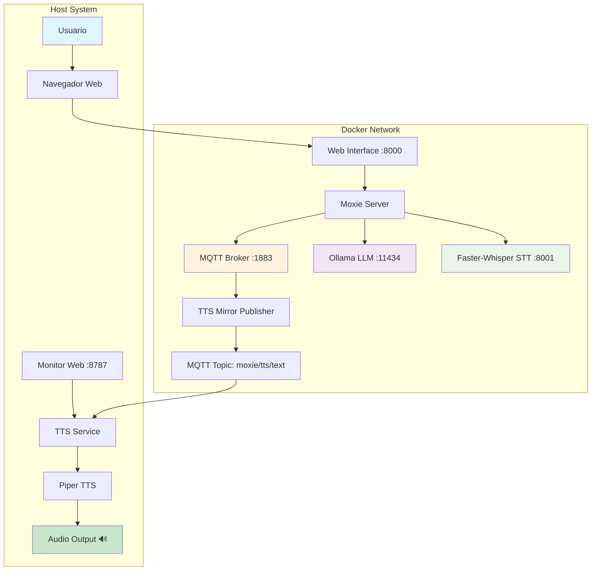

# 🏗️ Arquitectura de OpenMoxie Español

## Visión General

OpenMoxie Español implementa una arquitectura de microservicios basada en Docker con comunicación MQTT para el sistema TTS local.

## Diagrama de Arquitectura



## Componentes Principales

### 1. Interfaz Web (Puerto 8000)
- **Tecnología**: Django + Bootstrap
- **Función**: Interfaz principal de usuario
- **Características**:
  - Puppet Mode para envío de texto
  - Configuración del sistema
  - Panel de administración
  - Gestión de dispositivos

### 2. Moxie Server
- **Tecnología**: Python + Django
- **Función**: Núcleo del sistema
- **Responsabilidades**:
  - Procesamiento de comandos
  - Integración con servicios
  - Gestión de sesiones
  - Interceptación TTS

### 3. MQTT Broker (Puerto 1883)
- **Tecnología**: Eclipse Mosquitto
- **Función**: Comunicación entre servicios
- **Topics principales**:
  - `moxie/tts/text` - Mensajes para TTS
  - `moxie/status` - Estado del sistema
  - `moxie/config` - Configuración

### 4. Ollama LLM (Puerto 11434)
- **Tecnología**: Ollama
- **Función**: Procesamiento de lenguaje natural
- **Modelos soportados**:
  - `llama3.1:8b` - Modelo principal
  - `qwen2.5:7b` - Modelo alternativo
  - Modelos personalizados

### 5. Faster-Whisper STT (Puerto 8001)
- **Tecnología**: Faster-Whisper
- **Función**: Speech-to-Text
- **Características**:
  - Procesamiento local
  - Soporte multilingüe
  - Modelos intercambiables
  - API REST

### 6. TTS Service (Servicio de Usuario)
- **Tecnología**: Python + Piper TTS
- **Función**: Text-to-Speech local
- **Características**:
  - Voz española nativa
  - Reproducción automática
  - Monitor web integrado
  - Cola de mensajes

## Flujo de Datos

### 1. Flujo de Puppet Mode

```
[Usuario] → [Web Interface] → [Moxie Server] → [TTS Mirror] → [MQTT] → [TTS Service] → [Audio]
```

**Pasos detallados**:
1. Usuario escribe texto en Puppet Mode
2. Web Interface envía texto a Moxie Server
3. Moxie Server procesa el texto
4. TTS Mirror intercepta y publica a MQTT
5. TTS Service recibe mensaje MQTT
6. Piper TTS genera audio
7. Audio se reproduce en altavoces

### 2. Flujo de Chat con IA

```
[Usuario] → [STT] → [Moxie Server] → [Ollama] → [TTS Mirror] → [MQTT] → [TTS Service] → [Audio]
```

**Pasos detallados**:
1. Usuario habla al micrófono
2. Faster-Whisper transcribe audio
3. Moxie Server procesa transcripción
4. Ollama genera respuesta
5. TTS Mirror intercepta respuesta
6. TTS Service reproduce respuesta

## Configuración de Red

### Puertos Utilizados

| Servicio | Puerto | Protocolo | Descripción |
|----------|--------|-----------|-------------|
| Web Interface | 8000 | HTTP | Interfaz principal |
| MQTT Broker | 1883 | MQTT | Sin SSL |
| MQTT Broker | 8883 | MQTTS | Con SSL |
| Ollama | 11434 | HTTP | API LLM |
| STT Service | 8001 | HTTP | API Whisper |
| TTS Monitor | 8787 | HTTP | Monitor web |

### Red Docker

```yaml
networks:
  default:
    driver: bridge
    ipam:
      config:
        - subnet: 172.20.0.0/16
```

**Resolución de nombres**:
- `mqtt` → Broker MQTT
- `ollama` → Servidor LLM
- `stt` → Servicio STT
- `web` → Interfaz web

## Almacenamiento

### Volúmenes Docker

```yaml
volumes:
  - ./site/work:/app/site/work          # Base de datos SQLite
  - ./site/services/stt/models:/models  # Modelos Whisper
  - ./local/work:/local/work            # Logs MQTT
```

### Estructura de Archivos

```
openmoxie-espanol/
├── site/
│   ├── work/                 # Base de datos y logs
│   ├── services/stt/models/  # Modelos Whisper
│   └── hive/mqtt/           # Código MQTT
├── services/
│   ├── moxie-tts-subscriber/ # Servicio TTS
│   └── moxie-tts.service    # Systemd service
├── scripts/
│   └── install.sh           # Script instalación
└── docs/                    # Documentación
```

## Seguridad

### Autenticación
- **Web Interface**: Django sessions
- **Admin Panel**: Usuario/contraseña
- **MQTT**: Sin autenticación (red local)

### Comunicación
- **HTTP**: Sin cifrado (red local)
- **MQTT**: Sin cifrado por defecto
- **Docker**: Red interna aislada

### Recomendaciones
- Usar en red local únicamente
- Configurar firewall para puertos externos
- Cambiar contraseñas por defecto
- Habilitar MQTTS para producción

## Monitoreo

### Logs del Sistema

```bash
# Logs de servicios Docker
docker compose logs [servicio] -f

# Logs del servicio TTS
journalctl --user -u moxie-tts.service -f

# Logs del sistema
tail -f /var/log/syslog
```

### Métricas Disponibles

- **TTS Service**: Mensajes procesados, tiempo de respuesta
- **MQTT Broker**: Conexiones activas, mensajes/segundo
- **Ollama**: Uso de memoria, tiempo de inferencia
- **STT Service**: Transcripciones/minuto, precisión

### Health Checks

```bash
# Verificar servicios
curl -s http://localhost:8000/health
curl -s http://localhost:8001/health
curl -s http://localhost:8787/health

# Verificar MQTT
mosquitto_pub -h localhost -p 1883 -t "test" -m "ping"
```

## Escalabilidad

### Limitaciones Actuales
- **SQLite**: Base de datos de archivo único
- **Piper TTS**: Un proceso por vez
- **MQTT**: Broker único

### Mejoras Posibles
- **PostgreSQL**: Base de datos distribuida
- **Redis**: Cache distribuido
- **MQTT Cluster**: Múltiples brokers
- **Load Balancer**: Distribución de carga

## Troubleshooting

### Problemas Comunes

1. **Servicios no inician**
   - Verificar puertos ocupados
   - Revisar logs de Docker
   - Comprobar permisos

2. **Audio no se reproduce**
   - Verificar servicio TTS
   - Comprobar conexión MQTT
   - Revisar configuración audio

3. **Modelos no cargan**
   - Verificar espacio en disco
   - Comprobar permisos de archivos
   - Revisar URLs de descarga

### Comandos de Diagnóstico

```bash
# Estado general
docker compose ps
systemctl --user status moxie-tts.service

# Conectividad
nc -zv localhost 8000
nc -zv localhost 1883
nc -zv localhost 8787

# Recursos
df -h
free -h
top
```
