# 📡 Flujo MQTT en OpenMoxie Español

## Visión General

El sistema MQTT es el corazón de la comunicación entre el servidor web de Moxie y el servicio TTS local. Permite que todo el texto que Moxie va a decir se reproduzca automáticamente en el computador local.

## Arquitectura MQTT

```mermaid
sequenceDiagram
    participant U as Usuario
    participant W as Web Interface
    participant M as Moxie Server
    participant T as TTS Mirror
    participant B as MQTT Broker
    participant S as TTS Service
    participant P as Piper TTS
    participant A as Audio Output

    U->>W: Envía texto (Puppet Mode)
    W->>M: Procesa texto
    M->>T: Intercepta texto TTS
    T->>B: Publica a moxie/tts/text
    B->>S: Entrega mensaje
    S->>P: Genera audio
    P->>A: Reproduce audio
    S->>W: Actualiza monitor (8787)
```



## Componentes MQTT

### 1. MQTT Broker (Eclipse Mosquitto)

**Configuración**:
```yaml
# docker-compose.yml
mqtt:
  image: eclipse-mosquitto:2.0
  ports:
    - "1883:1883"
    - "8883:8883"
  volumes:
    - ./local/work:/mosquitto/data
```

**Características**:
- Puerto 1883: MQTT sin SSL
- Puerto 8883: MQTT con SSL (opcional)
- Persistencia de mensajes
- QoS 0, 1, 2 soportados

### 2. TTS Mirror Publisher

**Ubicación**: `site/hive/mqtt/mqtt_tts_mirror.py`

**Funcionalidad**:
```python
class TTSMirrorPublisher:
    def __init__(self, host="localhost", port=1883):
        self.client = mqtt.Client()
        self.host = host
        self.port = port
        
    def publish_text(self, text):
        """Publica texto al topic moxie/tts/text"""
        self.client.publish("moxie/tts/text", text, qos=1)
```

**Características**:
- Reconexión automática
- Chunking de mensajes largos (>400 chars)
- Logging detallado
- Manejo de errores

### 3. TTS Subscriber Service

**Ubicación**: `services/moxie-tts-subscriber/app.py`

**Funcionalidad**:
```python
def on_message(client, userdata, msg):
    """Procesa mensajes MQTT y genera audio"""
    text = msg.payload.decode('utf-8')
    logger.info(f"📨 Recibido: {text}")
    
    # Generar audio con Piper
    generate_and_play_audio(text)
```

**Características**:
- Suscripción a `moxie/tts/text`
- Cola de mensajes
- Monitor web integrado
- Logging de actividad

## Topics MQTT

### Principales

| Topic | Dirección | QoS | Descripción |
|-------|-----------|-----|-------------|
| `moxie/tts/text` | Publisher → Subscriber | 1 | Texto para TTS |
| `moxie/tts/status` | Subscriber → Monitor | 0 | Estado del servicio |
| `moxie/system/health` | Bidireccional | 0 | Health checks |

### Estructura de Mensajes

#### moxie/tts/text
```json
{
  "text": "Hola, soy Moxie hablando en español",
  "timestamp": "2025-09-18T10:30:00Z",
  "source": "puppet_mode",
  "chunk": 1,
  "total_chunks": 1
}
```

#### moxie/tts/status
```json
{
  "status": "playing",
  "current_text": "Hola, soy Moxie...",
  "queue_size": 2,
  "timestamp": "2025-09-18T10:30:05Z"
}
```

## Configuración

### Variables de Entorno

```bash
# Docker Compose
MQTT_HOST=mqtt              # Nombre del servicio
MQTT_PORT=1883             # Puerto sin SSL
MQTT_SSL_PORT=8883         # Puerto con SSL

# TTS Service
MQTT_TOPIC=moxie/tts/text  # Topic principal
MQTT_QOS=1                 # Quality of Service
MQTT_KEEPALIVE=60          # Keepalive en segundos
```

### Configuración del Broker

```conf
# mosquitto.conf
listener 1883
allow_anonymous true
persistence true
persistence_location /mosquitto/data/

# SSL (opcional)
listener 8883
cafile /mosquitto/certs/ca.crt
certfile /mosquitto/certs/server.crt
keyfile /mosquitto/certs/server.key
```

## Interceptación TTS

### Puntos de Interceptación

1. **Puppet Mode**: `site/hive/mqtt/moxie_server.py`
```python
def send_telehealth_speech(self, text):
    # Interceptar antes del TTS original
    self._tts_mirror.publish_text(text)
    # Continuar con TTS original (opcional)
```

2. **Chat Responses**: `site/hive/mqtt/moxie_remote_chat.py`
```python
def process_chat_response(self, response):
    # Interceptar respuestas del chat
    self._tts_mirror.publish_text(response)
```

3. **System Messages**: Interceptación global
```python
def intercept_all_tts(self, text):
    # Interceptar todos los mensajes TTS
    if self._tts_mirror:
        self._tts_mirror.publish_text(text)
```

## Manejo de Errores

### Reconexión Automática

```python
def on_disconnect(client, userdata, rc):
    logger.warning(f"Desconectado del broker MQTT: {rc}")
    while True:
        try:
            client.reconnect()
            logger.info("Reconectado al broker MQTT")
            break
        except Exception as e:
            logger.error(f"Error reconectando: {e}")
            time.sleep(5)
```

### Fallback Strategies

1. **Broker no disponible**: Continuar sin TTS mirror
2. **Mensaje muy largo**: Dividir en chunks
3. **Audio ocupado**: Encolar mensajes
4. **Error de Piper**: Log y continuar

## Monitoreo

### Logs MQTT

```bash
# Logs del broker
docker compose logs mqtt -f

# Logs del publisher (web)
docker compose logs web -f | grep -i mqtt

# Logs del subscriber (TTS)
journalctl --user -u moxie-tts.service -f
```

### Métricas

```bash
# Estadísticas del broker
mosquitto_sub -h localhost -p 1883 -t '$SYS/broker/messages/received'
mosquitto_sub -h localhost -p 1883 -t '$SYS/broker/clients/connected'

# Test de conectividad
mosquitto_pub -h localhost -p 1883 -t "test" -m "ping"
mosquitto_sub -h localhost -p 1883 -t "test"
```

### Monitor Web (Puerto 8787)

**Características**:
- Mensajes en tiempo real
- Estado de la cola
- Estadísticas de uso
- Logs de actividad

**Endpoints**:
- `/` - Dashboard principal
- `/api/status` - Estado JSON
- `/api/queue` - Cola de mensajes
- `/api/stats` - Estadísticas

## Troubleshooting

### Problemas Comunes

#### 1. Broker MQTT no accesible
```bash
# Verificar estado
docker compose ps mqtt

# Verificar logs
docker compose logs mqtt

# Test de conectividad
telnet localhost 1883
```

#### 2. Publisher no conecta
```bash
# Logs del web service
docker compose logs web | grep -i "mqtt\|tts"

# Verificar configuración
docker compose exec web env | grep MQTT
```

#### 3. Subscriber no recibe mensajes
```bash
# Verificar suscripción
mosquitto_sub -h localhost -p 1883 -t "moxie/tts/text" -v

# Logs del servicio TTS
journalctl --user -u moxie-tts.service -f
```

#### 4. Mensajes duplicados
- Verificar QoS settings
- Comprobar reconexiones múltiples
- Revisar retain flags

### Comandos de Diagnóstico

```bash
# Estado general MQTT
mosquitto_sub -h localhost -p 1883 -t '$SYS/#' -C 10

# Test completo del flujo
echo "Test message" | mosquitto_pub -h localhost -p 1883 -t "moxie/tts/text" -l

# Monitoreo en tiempo real
mosquitto_sub -h localhost -p 1883 -t "moxie/+/+" -v
```

## Optimización

### Performance

1. **QoS apropiado**: QoS 1 para TTS, QoS 0 para status
2. **Keep-alive**: 60 segundos para balance
3. **Clean session**: False para persistencia
4. **Message batching**: Agrupar mensajes cortos

### Escalabilidad

1. **MQTT Cluster**: Múltiples brokers
2. **Load Balancing**: Distribución de clientes
3. **Topic Sharding**: Dividir topics por función
4. **Retained Messages**: Para estado persistente

### Seguridad

1. **SSL/TLS**: Cifrado de comunicación
2. **Authentication**: Usuario/contraseña
3. **ACL**: Control de acceso por topic
4. **Network isolation**: Docker networks
